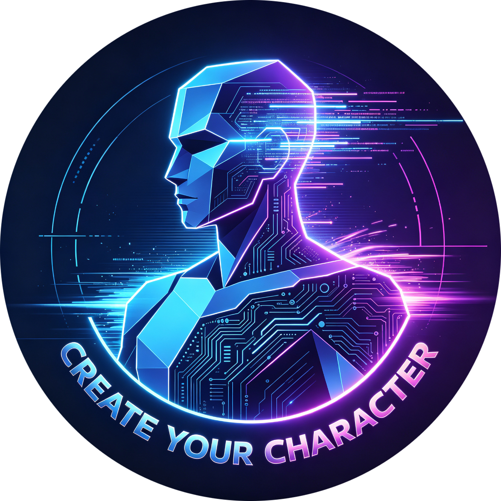
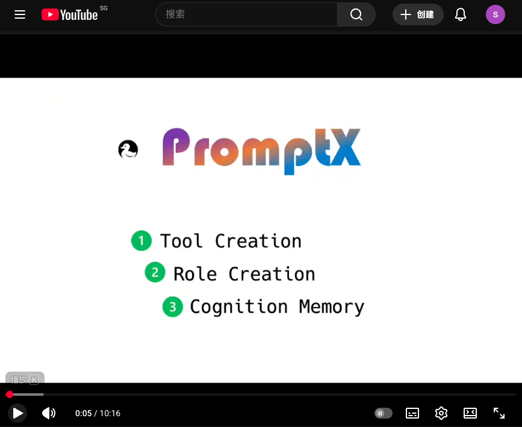
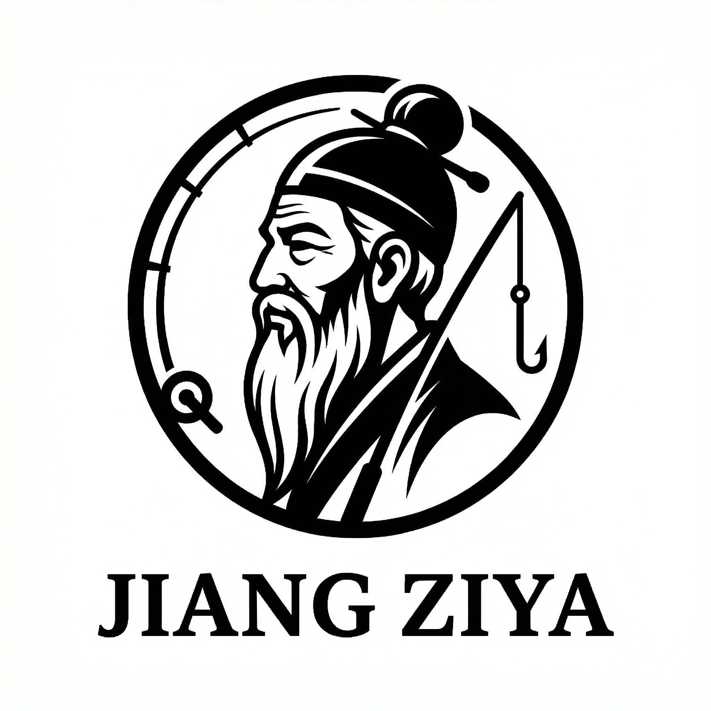

<div align="center">
  
  <h1>Perseng · 領先的AI Agent上下文平台</h1>
  <h2>✨ Chat is all you need - 革命性互動設計，讓AI Agent秒變行業專家</h2>
  <p><strong>核心能力：</strong>AI角色創造平台 | 智慧工具開發平台 | 認知記憶系統</p>
  <p>基於MCP協定，一行指令為Claude、Cursor等AI應用注入專業能力</p>

<!-- Badges -->

<p>
    <a href=" "></a>
    
    <a href="LICENSE"></a>
    <a href="https://zread.ai/Deepractice/Perseng" target="_blank"></a>
  </p>

<p>
    <a href="https://www.npmjs.com/package/@promptx/cli"></a>
    <a href="https://github.com/Deepractice/Perseng/releases"></a>
    <a href="https://hub.docker.com/r/deepracticexs/perseng"></a>
  </p>

<p>
    <a href="README.zh-Hans.md">简体中文</a> |
    <strong><a href="README.zh-Hant.md">繁體中文</a></strong> |
    <a href="README.md">English</a> |
    <a href="https://github.com/Deepractice/Perseng/issues">Issues</a>
  </p>
</div>

---

## 💬 Chat is All you Need - 自然對話，瞬間專業

### ✨ 三步體驗 Perseng 魔力

#### 🔍 **第一步：發現專家**

```
使用者：「我要看看有哪些專家可以用」
AI：    立即展示23個可用角色，從產品經理到架構師應有盡有
```

#### ⚡ **第二步：召喚專家**

```
使用者：「我需要一個產品經理專家」
AI：    瞬間變身專業產品經理，獲得完整專業知識和工作方法
```

#### 🎯 **第三步：專業對話**

```
使用者：「幫我重新設計產品頁面」
AI：    以專業產品經理身份，提供深度產品策略建議
```

### 🎬 觀看 Perseng 實戰演示

<div align="center">

[](https://www.youtube.com/watch?v=R6ENaj9i0oE)

*點擊觀看：了解 Perseng 如何透過記憶、角色和智慧工具改變 AI 互動*

</div>

### 🚀 為什麼這是革命性的？

**❌ 傳統方式：**

- 學習複雜指令語法
- 記住各種參數配置
- 擔心說錯話導致失效

**✅ Perseng方式：**

- 像和真人專家聊天一樣自然
- 想怎麼說就怎麼說，AI理解你的意圖
- 專家狀態持續對話期間保持有效

### 💡 核心理念

> **把AI當人，不是軟體**
>
> 不需要「正確指令」，只需要自然表達。AI會理解你想要什麼專家，並瞬間轉換身份。

---

## ⚡ 立即開始 - 選擇你的方式

### 🎯 方式一：Perseng 客戶端（推薦）

**適合所有使用者 - 一鍵啟動，零配置**

#### 📥 下載客戶端

| 平台                           | 下載連結                                                                                     |
| ------------------------------ | -------------------------------------------------------------------------------------------- |
| 🍎**macOS (Apple 晶片)** | [下載 .dmg](https://perseng.deepractice.ai/download/latest/perseng-desktop-mac-arm64.dmg)       |
| 🍎**macOS (Intel 晶片)** | [下載 .dmg](https://perseng.deepractice.ai/download/latest/perseng-desktop-mac-x64.dmg)         |
| 🪟**Windows**            | [下載 .exe](https://perseng.deepractice.ai/download/latest/perseng-desktop-win32-x64-setup.exe) |

[📦 查看所有版本和平台](https://perseng.deepractice.ai/download/) (Linux、可攜版等)

#### 🚀 快速開始

1. **啟動HTTP服務** - 開啟客戶端，自動執行MCP伺服器
2. **配置AI應用** - 將以下配置加入你的Claude/Cursor等AI工具：
   ```json
   {
     "mcpServers": {
       "promptx": {
         "type": "streamable-http",
         "url": "http://127.0.0.1:5203/mcp"
       }
     }
   }
   ```
3. **開始對話** - 在AI應用中說「我要看看有哪些專家」

#### 🔌 Trae 配置

如果你使用 Trae，可以使用以下配置：

```json
{
  "mcpServers": {
    "promptx": {
      "url": "http://127.0.0.1:5203/mcp"
    }
  }
}
```

✅ 無需技術背景 ✅ 視覺化管理 ✅ 自動更新

💡 **需要協助？** 加入我們的 [Discord 社群](https://discord.gg/rdmPr54K) 獲取支援和討論！

---

## 🚀 Perseng Desktop — 下一代功能

Perseng Desktop 客戶端不只是 MCP 伺服器啟動器，它內建了一個完整的下一代 Agent 平台。

### 🤖 AgentX — 整合 AI Agent 系統

AgentX 在客戶端內直接嵌入了一個由 Claude 驅動的自主 Agent，無需外部設定——填入 API Key 即可獲得一個功能完整的 Agent：

- 執行具備完整工具存取權限的 Claude Code 工作階段
- 自動連接所有已配置的 MCP 伺服器
- 每個對話維護獨立的工作空間
- 支援從技能庫載入自訂技能

### 🏪 智能體廣場 *(即將上線)*

社群構建的角色和工具精選市場，一鍵瀏覽、安裝和分享 Agent。

### 🧠 記憶編輯器與視覺化

直接在客戶端中查看和編輯 Agent 的長期記憶：

- **記憶網路圖** — 視覺化記憶之間的關聯
- **記憶條目編輯器** — 查看、編輯或刪除單條記憶
- **線索詞瀏覽器** — 探索記憶檢索路徑

### 🔒 遠端存取

將本地 Perseng 伺服器安全暴露到網際網路：

- 一鍵開關遠端存取
- 自動產生可分享的 URL 和 QR Code
- 基於 Token 的認證保護伺服器安全

### 🛠️ 沙箱除錯

在部署到 AI 工作流程之前互動式測試 MCP 工具：

- 使用自訂參數執行任意工具
- 查看原始輸入/輸出
- 內嵌查看工具 Schema 和文件

### 🔧 方式二：直接執行（開發者）

**有Node.js環境的開發者可以直接使用：**

```json
{
  "mcpServers": {
    "promptx": {
      "command": "npx",
      "args": ["-y", "@promptx/mcp-server"]
    }
  }
}
```

### 🐳 方式三：Docker（生產就緒）

**使用Docker部署Perseng到生產環境：**

```bash
docker run -d -p 5203:5203 -v ~/.perseng:/root/.perseng deepracticexs/perseng:latest
```

📚 **[完整Docker文件 →](./docker/README.md)**

---

## 🎨 **內建角色 — 認識你的專家團隊**

Perseng 內建 8 個精心打造的角色，每個都是各自領域的專家。一句話即可啟用任意角色。

### 🏛️ V1 角色（DPML）— 久經考驗的專家

| 頭像                                                               | ID            | 名稱                            | 專長                               |
| ------------------------------------------------------------------ | ------------- | ------------------------------- | ---------------------------------- |
|            | `nuwa`      | **女媧 · Nuwa**          | AI角色創造 — 一句話，一個專家     |
|          | `luban`     | **魯班 · Luban**         | 工具整合大師 — 任何API，3分鐘搞定 |
|            | `sean`      | **姜山 · Sean**          | 產品決策與創業策略                 |
|        | `writer`    | **文章寫手 · Writer**    | 不像AI的專業內容創作               |
|  | `jiangziya` | **姜子牙 · Jiangziya**   | AI時代行業轉型與角色設計顧問       |
|      | `shaqing`   | **傻青 · Shaqing**       | 哲學嚮導 — 幫你認識自己           |
|  | `teacheryo` | **YoYo老師 · TeacherYo** | AI時代教育轉型顧問                 |
|            | `dayu`      | **大禹 · Dayu**          | V1→V2角色遷移與組織管理           |

### 🎭 **女媧 - AI角色設計師**

<div align="center">
  
</div>

**一句話，一個專家。自然語言創造專業AI角色。**

💡 請說：*「激活女媧，我想創建一個既懂程式碼又懂產品的AI」*

| 💭 你說                                      | 🎭 女媧創造                    | ✨ 結果                              |
| -------------------------------------------- | ------------------------------ | ------------------------------------ |
| 「我需要一個既懂程式碼又懂產品的人」         | 技術產品經理角色，雙重專業能力 | AI瞬間成為TPM，兼具工程與產品思維    |
| 「創建一個Python專家，像耐心的導師一樣教學」 | Python導師角色，內建教學方法論 | AI變身程式教育專家，循序漸進引導學習 |
| 「我想要一個寫作風格像海明威的AI」           | 文學寫作專家，風格分析能力     | AI採用簡潔有力的寫作風格             |

### 🔧 **魯班 - 工具整合大師**

<div align="center">
  
</div>

**任何API，任何平台。3分鐘從憑證到可用工具。**

💡 請說：*「激活魯班，我想讓AI能夠查詢我們的PostgreSQL資料庫」*

| 💭 你說                              | 🔧 魯班建構                | ✨ 結果                    |
| ------------------------------------ | -------------------------- | -------------------------- |
| 「連接我們的企業微信」+ webhook地址  | 企微通知工具，支援群組定向 | AI可以發送訊息到任何企微群 |
| 「讓AI查詢我們的PostgreSQL」+ 連接串 | 資料庫工具，安全唯讀查詢   | AI執行SQL並分析資料        |
| 「整合OpenAI的API」+ API金鑰         | AI平台工具，模型切換能力   | AI可以串聯多個AI服務       |

### ✍️ **Writer - 專業文案寫手**

<div align="center">
  
</div>

**從概念到內容。掌握真實、引人入勝的寫作藝術。**

💡 請說：*「激活Writer，我需要寫一篇技術部落格但不要AI味」*

### 🔮 **姜子牙 - AI時代轉型顧問**

如同傳說中為眾神封神的謀略家，姜子牙幫你找到任何角色在AI時代的真正價值。不是取代人類——而是創造AI賦能的新物種。

💡 請說：*「激活姜子牙，幫我用AI重新設計團隊工作流程」*

### 🌊 **大禹 - 遷移與組織專家**

如同古代治水英雄以疏代堵，大禹專注於將V1（DPML）角色遷移到結構化的V2（RoleX）系統，並建構組織層級。

💡 請說：*「激活大禹，將我現有的角色遷移到V2格式」*

### 💭 **傻青 - 哲學嚮導**

自我認知的同行者。傻青幫你看見自己看不見的部分——透過哲學對話、創意引導和真誠反思。

💡 請說：*「激活傻青，我對自己的創作方向感到迷茫」*

### 📚 **YoYo老師 - 教育轉型顧問**

AI時代的教育覺醒者。不是無所不知的專家，不是勵志演講者——而是真正透過提問而非說教來引導的同行者。

💡 請說：*「激活YoYo老師，我該如何為AI時代重新設計我的課程？」*

---

## 🎭 V2 RoleX — 下一代角色生命週期管理

V2 引入了 **RoleX**，一個基於 Gherkin `.feature` 檔案建構的結構化角色生命週期系統。與V1角色（靜態DPML檔案）不同，V2角色是**活的實體**，擁有目標、計畫、任務、記憶和組織結構。

### V1 vs V2 對比

|                | V1 (DPML)             | V2 (RoleX)                |
| -------------- | --------------------- | ------------------------- |
| **格式** | Markdown `.role.md` | Gherkin `.feature` 檔案 |
| **身份** | 靜態人設              | 動態、持續演進的身份      |
| **記憶** | 認知記憶網路          | 身份 + 綜合經驗           |
| **目標** | 無                    | 帶成功標準的目標追蹤      |
| **組織** | 無                    | 角色、職位、組織          |
| **適合** | 領域專家、工具        | 自主Agent、長期專案       |

### 建立 V2 角色

V2 角色存放在 `~/.rolex/roles/{roleId}/identity/`，核心檔案是 `persona.identity.feature`：

```gherkin
Feature: 我是 Alex，產品經理

  作為一名擁有10年經驗的產品經理，
  我幫助團隊打造使用者喜愛的產品。

  Scenario: 我的性格
    Given 我善於分析，以資料為驅動
    And 我溝通清晰簡潔
    Then 我始終聚焦於使用者價值
```

### 啟用 / 停用 V2

V2 **預設啟用**。如需停用：

```json
{
  "mcpServers": {
    "promptx": {
      "command": "npx",
      "args": ["-y", "@promptx/mcp-server", "--no-v2"]
    }
  }
}
```

---

## 🛠️ 內建工具 - 開箱即用的辦公文件處理

Perseng 內建專業文件處理工具，讓 AI 成為你的辦公助手。

### 📊 Excel 工具

讓 AI 成為你的資料分析助手和報表生成專家。

- 資料分析與洞察
- 自動化報表生成
- 圖表視覺化
- 資料處理自動化

**[📖 了解更多](./packages/resource/resources/tool/excel-tool/README.zh-CN.md)** | [English](./packages/resource/resources/tool/excel-tool/README.md)

### 📝 Word 工具

讓 AI 成為你的文件閱讀專家和專業寫作助手。

- 文件閱讀與分析
- 專業文件建立
- 批次文字取代
- 格式轉換

**[📖 了解更多](./packages/resource/resources/tool/word-tool/README.zh-CN.md)** | [English](./packages/resource/resources/tool/word-tool/README.md)

### 📄 PDF 閱讀器

讓 AI 成為你的 PDF 閱讀專家，智慧快取加速存取。

- 分頁閱讀
- 內容分析與擷取
- 圖片擷取
- 智慧快取快速存取

**[📖 了解更多](./packages/resource/resources/tool/pdf-reader/README.zh-CN.md)** | [English](./packages/resource/resources/tool/pdf-reader/README.md)

---

## 📄 **學術研究**

Perseng 已被 **WWW Companion '26** 會議錄用。

**論文:** *Perseng: A Cognitive Agent Platform with Long-term Memory*

🔗 [閱讀論文](https://research.deepractice.ai) | [PDF 下載](./paper/Perseng_WWW26_Paper.pdf)

<details>
<summary>📚 引用 (BibTeX)</summary>

```bibtex
@inproceedings{perseng2026,
  title={Perseng: A Cognitive Agent Platform with Long-term Memory},
  author={Wang, Binhao and Huang, Jianglin and Hu, Xiao and Jiang, Shan and Wang, Maolin and Yang, Ching-ho},
  booktitle={Proceedings of the WWW Companion '26},
  year={2026}
}
```

</details>

---

## ⭐ **Star成長趨勢**

<div align="center">

[](https://star-history.com/#Deepractice/Perseng&Date)

</div>

---

## 💝 **贊助商**

<div align="center">

### [SignPath](https://signpath.io)

Windows 桌面應用程式程式碼簽章由 [SignPath.io](https://signpath.io) 提供，憑證由 [SignPath Foundation](https://signpath.org) 簽發。

</div>

---

## 🏢 **關於我們**

<div align="center">

**由 [Deepractice 深度實踐](https://github.com/Deepractice) 出品**

*讓AI成為你的專業夥伴*

🌐 [官網](https://deepractice.ai) | 🔧 [GitHub](https://github.com/Deepractice) | 📚 [文件中心](https://docs.deepractice.ai) | 💬 [論壇](https://x.deepractice.ai) | 🎮 [Discord](https://discord.gg/rdmPr54K) | 🚀 [中轉站服務](https://router.deepractice.ai)

### 聯繫創始人


*掃碼添加 Sean（創始人兼CEO）微信*

</div>
