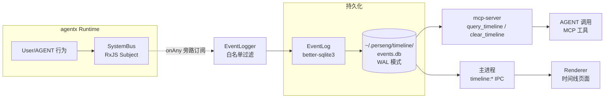

# Desktop App — 活动事件流时间线

> 持久化所有 SystemBus 事件的旁路系统。让 AGENT 和用户都能查询"最近做了什么"。

## 1. 概述

### 为什么需要
- **AGENT 时间感知差**：当前 systemPrompt 不注入时间，AGENT 不知道"上次会话发生了什么"
- **用户看不到 AGENT 的活动流**：谁调了哪个工具、返回什么、用户发了什么、AGENT 回了什么 — 全靠看聊天记录
- **历史检索需求**："昨天 14:00 我读过哪些文件"、"上周 AGENT 调过 `list_workspaces` 几次" 这类问题目前没法回答

### 是什么
**完全旁路的事件流持久化**：
- 订阅 `SystemBus.onAny()`（不修改任何 emit 路径）
- 写入独立 SQLite db (`~/.perseng/timeline/events.db`)
- 双入口查询：**AGENT** 调 `query_timeline` MCP 工具 / **用户** 在 UI 侧栏"时间线"页面查看

### 不是什么
| 不是 | 是什么 |
|---|---|
| Memory / Engrams | `cognition` 的**语义记忆**（抽象知识、需要时检索召回） |
| Chat history | 对话的"明文日志"（冗余、带格式、易腐） |
| Logs | 系统运行日志（`logs/*` 是 .log 文件，timeline 是结构化 db） |
| Audit log | 合规审计（没有签名/不可篡改保证） |

### 设计原则
1. **零侵入**：不动任何 emit 路径、不动任何核心模块（runtime / agentxjs / cognition）
2. **可降级**：db 写失败仅 warn，不影响主流程
3. **schema 演进兼容**：未来加向量索引（`event_embeddings` vec0）零迁移

---

## 2. 架构



**关键点**：
- `EventLogger` 不在 `emit` 路径上，纯 `onAny` 订阅 → 主流程**零行为变化**
- `AgentXService.start()` 末尾调用 `attachEventLogger()`，`stop()` 前调用 detach
- 主进程（`apps/desktop/src/main/index.ts`）直接 `import { getEventLog } from '@promptx/mcp-server/timeline'`，因为 desktop 已依赖 mcp-server
- Renderer 通过 `window.electronAPI.timeline.*` 调 IPC handler，再调 `getEventLog()`

---

## 3. 数据模型

### 3.1 Schema

```sql
CREATE TABLE IF NOT EXISTS events (
  id INTEGER PRIMARY KEY AUTOINCREMENT,
  ts INTEGER NOT NULL,              -- SystemEvent.timestamp (ms since epoch)
  sessionId   TEXT,                  -- SystemEvent.context.sessionId
  containerId TEXT,                  -- SystemEvent.context.containerId
  agentId     TEXT,                  -- SystemEvent.context.agentId
  imageId     TEXT,                  -- SystemEvent.context.imageId
  type TEXT NOT NULL,                -- SystemEvent.type (e.g. user_message)
  role TEXT NOT NULL,                -- 推断的角色 (user/assistant/tool_call/...)
  payload TEXT NOT NULL,             -- JSON.stringify(SystemEvent.data)
  createdAt INTEGER NOT NULL         -- 本地入库时间 (ms)
);

CREATE INDEX IF NOT EXISTS idx_events_ts      ON events(ts DESC);
CREATE INDEX IF NOT EXISTS idx_events_session ON events(sessionId, ts DESC);
CREATE INDEX IF NOT EXISTS idx_events_agent   ON events(agentId, ts DESC);
CREATE INDEX IF NOT EXISTS idx_events_image   ON events(imageId, ts DESC);
CREATE INDEX IF NOT EXISTS idx_events_type    ON events(type, ts DESC);
```

### 3.2 角色推断（写入时计算一次）

```ts
inferRole(type):
  user_message                       → user
  tool_use_content_block_start       → tool_call
  tool_result                        → tool_result
  message_stop | text_content_block_*→ assistant
  其他                                → system
```

### 3.3 白名单（EventLogger 默认过滤）

只入库"有意义"的事件，跳过高频 `text_delta`：

```ts
new Set([
  'user_message', 'message_stop',
  'tool_use_content_block_start', 'tool_result',
  'text_content_block_start', 'text_content_block_stop',
  'image_create_request', 'image_create_response',
])
```

`text_delta` 每 token 一次，跳过以免 db 撑爆；用 `text_content_block_stop` 代替捕获最终文本。

### 3.4 Schema 演进（预留）

未来加向量索引（用户允许时）：
```sql
-- 阶段 2：装 sqlite-vec 后
CREATE VIRTUAL TABLE IF NOT EXISTS event_embeddings USING vec0(
  embedding float[1536], event_id INTEGER, model TEXT
);
```
**不影响 events 表结构**，`payload` 是 JSON TEXT 本身就是 embedding 锚点。

---

## 4. MCP 工具（AGENT 入口）

AGENT 通过 `query_timeline` / `clear_timeline` 主动查询。两个工具已在 `packages/mcp-server/src/tools/timeline.ts` 注册。

### 4.1 `query_timeline`

```json
{
  "limit": 50,                    // 1-500
  "order": "desc",                // "asc" | "desc"
  "sessionId": "abc-123",         // 可选过滤
  "agentId": "agent_xyz",         // 可选过滤
  "imageId": "img_789",           // 可选过滤
  "types": ["user_message"],      // 可选过滤
  "roles": ["user", "assistant"], // 可选过滤
  "sinceTs": 1719792000000,       // 起始 ms
  "untilTs": 1719878400000,       // 结束 ms
  "cursor": 73                    // 翻页（=上次 nextCursor）
}
```

返回：
```json
{
  "events": [{ "id", "ts", "type", "role", "sessionId", "agentId", "imageId", "payload" }],
  "nextCursor": 73,               // null = 最后一页
  "total": 412
}
```

### 4.2 `clear_timeline`

```json
{
  "scope": "all",                 // "all" | "session" | "agent" | "image"
  "targetId": "abc-123"           // scope≠all 时必填
}
```

⚠️ 不可恢复。建议优先用 UI 清空按钮（带二次确认）。

---

## 5. UI 集成（用户入口）

### 5.1 入口位置

**主窗口侧栏**"时间线"图标（与 Logs / Roles / Tools 平级）。

### 5.2 界面布局

```
┌──────────────────────────────────────────────────────┐
│ [scope▼] [scopeId____] [all|user|asst|tool*] [time▾] │ ← 顶部过滤栏
│                              [清空🗑]                │
├──────────────────────────┬───────────────────────────┤
│ 共 N 条                   │ 事件详情                  │
│ ┌──────────────────────┐ │ ┌───────────────────────┐ │
│ │ 14:23 user 你好       │ │ │ 类型: user_message    │ │
│ │ 14:23 tool list_works │ │ │ 角色: user            │ │
│ │ 14:23 tool_result [...│ │ │ 时间: 14:23:45        │ │
│ │ ...                   │ │ │ 会话: abc-123         │ │
│ └──────────────────────┘ │ │ payload: { ... }     │ │
│ [加载更多]                │ └───────────────────────┘ │
└──────────────────────────┴───────────────────────────┘
```

### 5.3 清空二次确认

点击"清空"按钮 → AlertDialog 弹窗 → 用户确认 → toast 提示 → 列表刷新。
防误触，scope 选择支持 `all / session / agent`，非 `all` 时需要填 `targetId`。

### 5.4 实时性

时间线**不实时推送**：UI 只在用户进入页面 / 切换 filter / 点刷新时拉取。
未来可加 `timeline:onNewEvent` event 推送增强实时性（schema 兼容，零迁移）。

---

## 6. 关键路径

| 用途 | 路径 |
|---|---|
| 持久化 db | `~/.perseng/timeline/events.db` |
| 旁路订阅入口 | `apps/desktop/src/main/services/AgentXService.ts` (start / stop) |
| EventLog 实现 | `packages/mcp-server/src/timeline/EventLog.ts` |
| EventLogger 订阅 | `packages/mcp-server/src/timeline/EventLogger.ts` |
| 单例管理 | `packages/mcp-server/src/timeline/instance.ts` |
| MCP 工具 | `packages/mcp-server/src/tools/timeline.ts` |
| 主进程 IPC handlers | `apps/desktop/src/main/index.ts:setupTimelineIPC()` |
| Preload 桥接 | `apps/desktop/src/preload/index.ts` (timeline.*) |
| UI 页面 | `apps/desktop/src/view/pages/timeline-window/` |
| 侧栏入口 | `apps/desktop/src/view/pages/main-window/index.tsx` |

---

## 7. 常见问题

### 7.1 启动后时间线为空

**排查顺序**：
1. AgentX 是否启动？侧栏 → AgentX 状态指示
2. filter 太严？取消所有过滤看是否有数据
3. db 是否损坏？
   ```bash
   sqlite3 ~/.perseng/timeline/events.db "SELECT COUNT(*) FROM events"
   ```
   报错 → 删 db 重启（`rm ~/.perseng/timeline/events.db*`）

### 7.2 `better-sqlite3` 加载失败

这是**原生模块**，跨平台需要分别编译：
```bash
pnpm rebuild better-sqlite3
```
详见 [desktop-startup-dev.md §9.2](./desktop-startup-dev.md#92-better-sqlite3-加载失败)。

### 7.3 列表加载慢

- 默认 `limit=50`，最大 500；按需调整
- 用 `sessionId` / `agentId` 缩窄范围（走索引）
- 用 `roles` 过滤（避免拉所有 `text_delta` 之类的高频噪声）— 注意 `text_delta` 本来就在白名单外

### 7.4 AGENT 不知道时间线存在

AGENT 的 systemPrompt 不包含时间线工具说明。两种办法：
1. **手工告诉 AGENT**："用 query_timeline 查你最近的工具调用历史"
2. **未来**：在 role.md 里加 `<execution>` 块把 `query_timeline` 列为默认能力（参考 `packages/resource/resources/role/shaqing/execution/` 模式）

### 7.5 跨进程隔离问题

> AGENT 调 MCP 工具 / UI 调 IPC — 写的是同一个 db（`~/.perseng/timeline/events.db`），WAL 模式天然并发安全。

UI 清空事件后，AGENT 再查会看到 0 条 — 这是预期行为。如果要保留"AGENT 视图"和"用户视图"分离，未来可加 `view: 'agent' | 'user'` scope 字段（schema 兼容）。

### 7.6 db 太大

WAL 模式不会自动 vacuum。手动清理：
```bash
sqlite3 ~/.perseng/timeline/events.db "VACUUM"
```
未来可加定时清理策略（保留最近 N 天）。

---

## 8. 后续路线

- [ ] **向量索引**：装 sqlite-vec → 加 `event_embeddings` 表 → `query_timeline` 加 `mode: 'semantic'` 召回 topK
- [ ] **实时推送**：主进程 → renderer 用 `webContents.send('timeline:onNew', event)` 实时刷新
- [ ] **聚合视图**：按 session 折叠，timeline 显示"会话"而不是"事件"
- [ ] **导出**：用户导出某个 session 的时间线为 JSON / Markdown